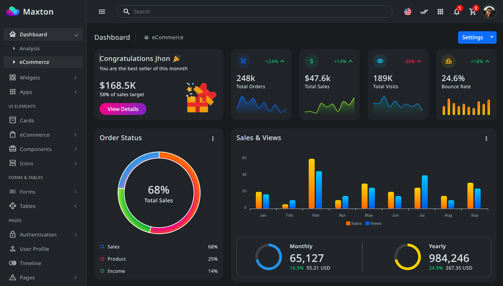

# 🏫School Management System

[](https://www.passerellesnumeriques.org/what-we-do/cambodia/)

A Node.js-based application designed to simplify and automate school administrative tasks such as managing students, teachers, classes, attendance, and more.

#

## 📚 Table of Contents 

-  [Features](https://www.w3schools.com/tags/tag_form.asp)
-  [Tech Stack](https://www.youtube.com/)
-  [Installation](https://www.youtube.com/)
-  [Usage](https://www.w3schools.com/tags/tag_form.asp)
-  [API Endpoints](https://www.youtube.com/)
-  [Environment Variable](https://www.youtube.com/)
-  [Scripts](https://www.youtube.com/)
-  [Cotributors](https://www.w3schools.com/tags/tag_form.asp)
-  [Contributing](https://www.youtube.com/)
-  [Environment Variable](https://www.youtube.com/)

#

## ✨ Features

- Student & Teacher Management
- Class & Subject Assignment
- Attendance Tracking
- Exam Results
- User Authentication (JWT)
- Admin Dashboard

#

## 🛠 Tech Stack
- Programming Language: JavaScript (Node.js)
- Runtime: Node.js
- Framework: Express.js
- Database: MongoDB / Mongoose (or MySQL / Sequelize)
- Authentication: JSON Web Token (JWT)
- Environment Management: dotenv
- Testing: Jest / Mocha (optional)

[](https://www.passerellesnumeriques.org/what-we-do/cambodia/)
[](https://www.passerellesnumeriques.org/what-we-do/cambodia/)
[](https://www.passerellesnumeriques.org/what-we-do/cambodia/)
[](https://www.passerellesnumeriques.org/what-we-do/cambodia/)

#

## 🚀 Installation

 ```python
 git clone https://github.com/your-username/school-management-system.git

 ```
 ```python
 cd school-management-system

 ```

 ```python
 npm install
 ```

 ## Screenshot
 

## 🔧 Usage

To run the server in development mode:

```python 
npm run dev

```
To start the server normally:

```python
npm start
```
Access the API at

```python
http://localhost:3000/api
```
## 📮 API Endpoints

| Method | Endpoint | Description | 
|----|------|-----|
| POST | /api/auth/ogin | Login to system|
| GET | /api/students | Login to system|
| POST | /api/students | Login to system|
| PUT | /api/students/:id | Login to system|
| DELETE | /api/students/:id | Login to system|


## 🔑 Environment Variables

Create a `.env` file in the root directory and add:

```python
PORT=3000
DB_URI=your_database_connection_string
JWT_SECRET=your_jwt_secret_key
```

## 🧪 Scripts

```python
npm start       # Start the server
npm run dev     # Start wit nodemon
npm test        # Run test cases
```

## 👥 Contributors


## 📄 License

This project is licensed under the MIT License. See the LICENSE file for more details.

```python
---

Let me know:
-if your project uses MongoDB or MySQL (so I can adjust that part),
-if you want to include screenshots or setup diagrams,
-or if you'd like this saved as a downloadable `.md` file.

```


